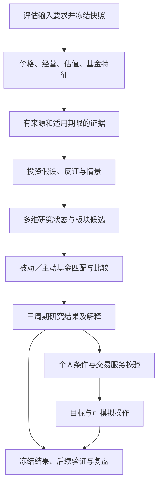

# 投资分析与建议：开发方案

- 更新日期：2026-09-14
- 对应范围：[整体技术架构](technical-architecture.md) §3.3。
- 文档状态：完整研究与推荐链路仍为开发设计；已实现 §1.5 的轻量板块证据筛查，正式操作建议与投资效果验证尚未实现，本文不表示策略已具备收益优势。
- 实施入口：[分阶段开发与复查计划](investment-analysis-plan.md)。开发状态只在该计划的小阶段表维护。
- 需求依据：[产品目标与用户流程](product-goals-and-user-flow.md)、[界面展示与交互](ui-interaction-design.md)、[基金数据与存储](fund-data-storage-design.md)。

## 1. 目标、范围与当前基础

### 1.1 本阶段交付目标

建立可复算、可追溯的研究与推荐链路：对 A 股相关基金及板块，同时形成短、中、长期判断，解释底层资产的收益驱动、当前价格反映的预期、市场反应、主要反证及基金匹配关系；具备个人条件及交易服务时，进一步形成可校验、可模拟的操作建议。

核心问题依次是：未来可能获得什么收益；有哪些可观察变化支持它；当前价格是否已充分反映；什么变化会推翻判断；哪只基金适合表达这一观点；当前账户是否需要操作。

价格／净值与非价格资料并行参与分析。历史涨幅、均线及 MACD／KDJ 等只能形成待验证特征，不能直接证明未来表现。首版不采用未经验证的统一总分、固定指标投票或上涨概率；讨论中出现的具体权重、70 分门槛等不作为实施默认参数。价格模型保留为研究对照，是否增加指标由独立验证决定。

### 1.2 产品范围与能力分级

基金库范围沿用产品需求，不因某个模型暂时不支持而删除基金。分析按资料能力开放：

| 可用能力 | 可交付内容 | 不足时的处理 |
| --- | --- | --- |
| 真实走势描述 | 原始净值／交易 K 线；口径足够时计算总收益、风险及相对表现。 | 只展示能够核验的内容，标明分红、基准、样本等缺口。 |
| 多来源研究 | 投资假设、经营／估值／市场等维度、证据、情景和研究候选。 | 必需证据缺失时显示依据不足，不由走势代填。 |
| 个人操作建议 | 基于已确认持仓、资金与规则生成目标及可模拟动作。 | 个人条件或 §3.4 交易计算服务缺失时，保留研究结论，标记操作待评估。 |

先在来源明确的有限宽基／行业样本上验证完整链路，再扩展覆盖；具体行业和基金在 A0 按数据可得性确定，不预设某真实基金值得投资。被动基金与主动基金均在设计范围，分别设准入和评价方法。货币、纯债、QDII 等不直接套用权益模型；无对应模型时明确不支持本研究方法。

### 1.3 当前实现与尚缺基础

当前已有 FastAPI／SQLite、真实基金目录、部分净值／场内日行情及关联指数的最小切片，建议页仍是演示。`backend/storage/timeseries.py` 导入时替换当前序列，`related_market.py` 保存当前关联与序列；它们尚无本方案所需的不可变事实版本、完整身份关系和历史输入快照。已有真实图表不等于可以复现历史研究。

`evaluate_requirements`、`create_snapshot`、`/api/v1`、完整披露穿透及正式费用服务均属于已规划或本方案拟新增能力，不能写成现有接口。可以先用明确标识的离线样本开发纯计算与契约；正式数据开放必须满足 §3 的依赖及验收。

### 1.4 与相邻章节的责任边界

| 所有者 | 责任 |
| --- | --- |
| §3.2 数据与存储 | 来源准入、原始事实／修订、稳定身份、日历、分红拆分、披露与规则、材料、质量及快照；新增经营／估值等事实也走此数据通道。 |
| §3.3 本方案 | 分析要求、衍生指标、投资假设、证据融合、板块与基金研究、目标建议、解释及验证规范。 |
| §3.4 账本与模拟 | 已确认余额、交易批次、费用、成交和确认规则、现金流、真实记账与执行模拟。§3.3 消费服务，不复制第二套计费／记账逻辑。 |
| §3.5 策略改良 | 候选版本、验证比较、本人显式启用、后续跟踪和恢复；本阶段提供完整输入输出与评估接口。 |
| §3.6 本地运行 | 调度、运行管理、密钥与配置、备份恢复；分析任务复用统一任务设施。 |

### 1.5 轻量板块机会的当前实现

“基金与板块 → 板块机会”通过 `GET /api/sectors/opportunities` 读取当前热门板块、原有真实指数、已核验行业背景和有限估值快照，使用同一卡片结构展示。新增板块只开放已经具备的数据能力；不根据名称相似度套用其他指数的经营、估值或基金映射。原有半导体、生物医药、房地产三个指数保留在独立观察范围，分别使用电子设备制造业、医药制造业、全国房地产开发企业背景；这些范围与成分公司并不相同。

- **热度观察池**：完整读取东方财富行业、概念目录，以来源最新交易日成交额（元）排序取前 100，等额按板块代码排序。地区分类不纳入，平台概念中的资格／风格集合及上下层行业按来源保留，明确成分交叉、成交额不可加总为市场成交额。交易热度偏向规模大的板块，不是人气、资金净流入或投资价值。来源业务日期与采集时间分别记录，分页采集不宣称同一瞬时快照。
- **采集与身份**：`scripts/import_sector_heat.py` 采集榜单、约一年日线和完整成分股；`sector_heat_snapshot`／`sector_heat_member` 保存当前榜单及真实采集结果，`sector_taxonomy_revision`／`sector_identity_revision` 按来源业务日期保留分类与身份版本，`sector_membership_snapshot`／`sector_membership` 保存成分关系快照。它们与国证／中证指数存储分开，只开放市场观察用途，不自动映射基金。来源未提供板块官方权重，保存的总市值只作原始成分资料，不能冒充权重。榜单失败保留旧榜及失败标识；单板块日线或成分失败分别保留同日旧数据并披露失败，失效日线不参与本次排序。来源成功返回但历史太短时仍不能参与缺少样本的周期比较。
- **走势强度及排序**：短／中／长期走势分别描述过去 20／60／120 个交易日，按同周期价格涨跌幅排名，支持从强到弱及从弱到强。排名仅比较最新日期与榜单日相同、观察起点与同组多数样本相同的有效样本，防止缺行导致实际区间不同；失效样本两种排序均置末。热度池和原有指数各自计算名次，不能混称同一个榜。价格变化按展示精度并列，名次为竞争排名（如 1、1、3），分位按并列平均位置计算、0 最弱／100 最强、全体相同为 50，单一样本不输出分位。该数值不是胜率或投资综合分。搜索、筛选和分页不改变原始样本排名，代码稳定打破展示顺序中的平局。
- **清楚区分时间含义**：每周期先显示历史观察窗口、实际涨跌、上涨／下跌／上涨后回落／下跌后修复状态及可比较样本数，再显示对应未来判断期限及证据。未来 1 周—1 个月看具体催化与预期差，未来 1—3 个月看经营兑现，未来 3—6 个月看持续盈利、现金流及估值；历史上涨不能直接转成未来看涨。

- **行业事实**：`config/sector-industry-evidence.json` 保存国家统计局 2026 年 1—6 月及 1—7 月的两项关键指标、来源、报告期、公开时间和取得时间。电子／医药观察营业收入与利润，房地产观察销售额与到位资金。两期累计同比变化只作描述，不称月环比、不作为独立样本投票。该文件是有限人工核验快照，不是自动采集与历史事实版本库；工业部分依据官方页面搜索索引原表行核对，直接全文读取超时的限制随文件保留。
- **估值观察**：`config/sector-valuation-evidence.json` 保存官方响应中的有限估值。国证未提供估值业务日期，动态市盈率不默认解释为 TTM；中证候选滚动市盈率只有适配器列映射，方法未确认。原数值及限制可查看，不能据此输出历史分位、便宜／昂贵或潜在回报。保存时间不冒充业务日期。
- **三周期职责**：短期核对近期催化及预期差；中期核对经营兑现与价格反应；3—6 月核对持续性、现金流与估值。输出“等待近期催化”“行业与走势分歧”“盈利质量待核查”“经营压力待缓解”等条件状态，同时列出支持、反证与限制、后续确认条件、缺项。缺少行情不能覆盖仍有效的经营反证；仅价格强势不能生成推荐。
- **走势佐证**：20／60／120 个交易日各需 21／61／121 个日收盘价。区间变化超过 +1% 且高于窗口均线为“上涨走势”；低于 −1% 且低于均线为“下跌走势”。区间上涨但回到均线或其下方写“上涨后回落”，区间下跌但回到均线或其上方写“下跌后修复”，±1% 内写“区间变化有限”，不因此声称期间低波动。最大回撤不高于 −10% 时单独提示。这些初始描述参数不承担强度排名权重，不是已验证的投资阈值。
- **时间与缺失**：只使用计算日及以前行情；最新行情超过 10 个自然日、窗口内间隔超过 14 个自然日、无效价格或样本不足时暂停价格判断。行业最近公布数据超过 45 个自然日时暂停经营状态；估值观察超过 10 天只供核对旧资料。公开／取得时间晚于计算时点的证据不能使用。上述日数是初始保守规则，尚未接入完整交易日历；源端当日行情仍可能修订。
- **运行与验证边界**：重新评估只读本地资料，不调用 AI、不外部采集、不执行交易。页面披露方法、评估时间、来源和缺项。当前没有足量历史非价格快照、成分穿透或样本外证据，不宣称预测准确率；计算及界面测试通过只说明规则正确执行。完整链路仍按 A0—A6 实施，此轻量入口不替代对应验收。

## 2. 分析链路与三个周期

### 2.1 主链路

AI 可以参与材料提取、假设和解释，输入输出须经本地校验；AI 不绕过任一资料、资金或执行条件。

### 2.2 时间定义

产品的“长期”是 3–6 个月，不等同多年资产配置。三个周期都返回结果，不能以先选周期作为浏览前提。

| 周期 | 本方案的持有期边界 | 分析侧重点 |
| --- | --- | --- |
| 短期 | 自可执行起点起，满 7 个自然日至不足 1 个自然月。 | 事件与预期变化、价格响应、流动性及短期成本。 |
| 中期 | 满 1 个自然月至不足 3 个自然月。 | 盈利／行业变化能否持续，估值与市场反应是否支持。 |
| 长期 | 满 3 个自然月至含 6 个自然月。 | 驱动的可持续性、情景空间、风格及组合风险。 |

自然月按日历加月，目标月无同日取月末。边界按可执行起点计算；评估终点遇非开放日，按预先冻结的执行政策映射到随后实际可执行日，并记录延后原因，不倒用前一个已错过价格。每个实验另固定具体评估终点；宽泛区间不能直接充当一条收益标签。

分别保存持有期、回看窗口、计算截止时点、重算触发、复查时间、失效条件。持有三个月不等于只读取三个月数据。日指标按各自有效交易／估值日历计算；财报等低频资料按实际发布事件更新，不通过每日填充伪造新增证据。

默认在预期应公布的日数据更新后及重要资料变更后评估是否需要重算；重算不等于调仓。常规换仓缓冲／冷却及周期窗口在实验政策中定义，不能阻止明确风险约束或投资假设失效的重新评估。

## 3. 输入依赖、来源与资料准入

### 3.1 正式能力的前置条件

| 能力 | 对应数据计划依赖 | 开放前必须成立 |
| --- | --- | --- |
| 固定输入与身份 | D1.2–D1.4、D4.2、D4.4 | 可按稳定身份评估要求、冻结修订和读取完整快照；不以基金代码当所有实体的唯一身份。 |
| 走势／总收益 | D2.1–D2.4 | 序列、日历、分红拆分、口径及质量足够；没有事件资料不能声称总收益已准确计算。 |
| 归属与基金匹配 | D3.1–D3.3 | 披露范围、指数／分类版本、ETF 联接关系与未知部分可追溯。 |
| 规则与材料 | D3.4、D3.5 | 规则及材料有版本、公开时间和适用范围。经营／估值／预测等新增数据另逐项准入。 |
| 历史研究／修订 | D4.1、D4.3 | 可知时点选择和修订影响可验证；没有历史版本时不能开展严格的当时信息回测。 |
| 任务与真实界面 | D1.5、D2.5；D1.8、D2.6、D3.6 | 持久任务和错误恢复，真实／演示隔离，来源与状态可见。 |

表中编号描述能力依赖，不代表这些阶段已经完成；实施前同时检查实际代码、测试及用户复查状态。各数据集可分批开放，未支持范围保持缺口，不要求先完成与本次无关的全部数据功能。

### 3.2 非价格资料矩阵

| 资料 | 首选证据与数字化内容 | 必须保留的限制 |
| --- | --- | --- |
| 经营与盈利质量 | 公司／基金披露、交易所公告；收入、利润率、经营现金流、库存及应收等。 | 合并范围、币种、会计期、一次性损益、重述版本；不能将不同口径直接同比。 |
| 行业供需 | 可核验的官方统计、行业协会或企业经营披露；销量、订单、库存、产能、价格、成本。 | 覆盖对象、统计方法、季节性、发布滞后；不能把需求增长机械解释成利润增长。 |
| 盈利预期与修订 | 有明确权限和历史版本的数据源，或有出处的分析假设。 | 一致预期不等于市场全部预期；没有当时预测版本，不倒填最新预测。AI 不补造缺失值。 |
| 估值及价格隐含要求 | 指数提供方／可靠财务与行情资料；PE、PB 与 ROE、盈利正常化等适用方法。 | 亏损、周期高点、成分变化、聚合方法；不能把基金单位净值高低当贵便宜。 |
| 宏观与政策 | 央行、统计及政策发布部门；利率、信用、汇率、实施条件等。 | 从变量到行业盈利／折现率的传导要单独说明；政策标题不直接触发买入。 |
| 资金与拥挤 | 可核验基金份额／申赎、成交、价差、折溢价及集中度。 | 规模变化含价格影响，份额变化含拆分／套利等；不能据此识别机构身份和真实动机。 |
| 基金管理与风格 | 招募说明书、定期报告、经理变更、规模、组合与费率资料。 | 当前经理与历史记录分段，持仓滞后、可识别风格与未解释部分分别保存。 |

来源准入复用 §3.2 注册表和验证方式。新增数据集需列出字段／单位／分母、真实样本、公开及修订时点、可留存与可发送范围、失败状态、覆盖和成本；来源探针通过不等于结构化数据已入库。经营、估值、预期数据并未因 D0.3 已通过而自动获得准入。

资料暂不可得时，可以导入有来源的人工记录或仅做不含该证据的受限研究；不得静默替换为新闻印象、模型知识或平均值。每个投资假设声明必需与可选资料，缺少必需项时停止该假设的候选晋级。

### 3.3 输入选择与时点

分析先提交 `requirements`：对象／身份、数据集、业务区间、回看窗口、最小样本、缺口容忍、币种／口径、选择模式和截止时点；数据层返回可用项与缺项，再创建快照。计算阶段只读取该快照，不一边计算一边查询 latest。

沿用数据设计的 `latest`、`system_as_of`、`public_as_of` 及实际公开／首次观察／提交时间语义。latest 仅用于准备当前快照；旧研究不以 latest 重建。发布日期未知或仅有日期时采用数据层的保守可用界限，不能把报告期末或当前下载时间倒填成历史可知时刻。

同一快照内资料可以有不同报告期和新鲜度。更正、新财报、分类或基金归属变更产生新快照与新运行，旧结论保留。

## 4. 投资假设与收益驱动

### 4.1 假设是研究的组织单位

每个 `thesis` 至少保存：适用行业／风格／基金类型、周期、预期收益来源、可观察驱动、传导路径、市场已反映程度的判断依据、必要证据、主要替代解释、催化／复查事件、反证条件、失效条件及版本。

假设应能回答“何种数据变化会使我调整判断”。只写“政策利好”“主力吸筹”“趋势不错”不能形成完整研究。价格高低点不能直接证明限价墙、洗盘或机构试探；用户提供的价格行为文章可作为研究线索，不作为市场机制或预测效果已经成立的证明。

### 4.2 首批研究模板

| 模板 | 要检验的传导关系 | 主要反证／边界 |
| --- | --- | --- |
| 盈利与现金流改善 | 需求／价格／成本变化 → 收入、利润率及现金流 → 可持续盈利。 | 供给扩张、降价、应收增加、一次性收益，使表面增长不转化为利润质量。 |
| 估值与预期修正 | 新信息改变盈利或风险判断；当前价格仍未要求过于乐观的情景。 | 改善已被价格提前反映、估值收缩、盈利口径失真；低估值本身不代表反转。 |
| 宏观／政策传导 | 利率、信用、汇率或实施细则通过可说明路径影响目标资产。 | 政策落地慢、需求弱、融资传导失效或负面影响抵消；不做“一降息全部看多”。 |
| 价格与交易反应 | 已知事件之后，相对表现、风险及流动性是否符合原假设。 | 反应来自大盘／风格、折溢价或其他事件；同向不等于因果，短期反馈不直接外推六个月。 |

先为来源足够的研究对象建立少量模板，不要求首版解释全部行业。每个模板定义具体字段、判定表达式、适用前提、观察窗口、缺失政策和测试样本；没有可执行规则的模板只显示研究笔记，不进入自动推荐。

收益可以按现金回报、盈利变化与估值重定价来建立假设，这是一种组织分析的方法，不自动提供预测优势。[CFA Institute：资产类别收益预期](https://www.cfainstitute.org/insights/professional-learning/refresher-readings/2026/capital-market-expectations-part-ii)。

### 4.3 情景分析

对适用对象构造乐观、基准、悲观情景，保存每项假设来源、合理区间、计算口径、适用期限及敏感性。盈利为正且口径一致时，可用 `价格 = 每股盈利 × 估值倍数` 检查估值收缩如何抵消盈利增长；指数聚合需处理成分与权重，不能平均 PE 代替指数估值。

情景不是概率预测。缺少经验证的概率时不赋予三种情景任意概率，也不输出伪精确期望收益。只有资料、持仓及映射足够时才把资产情景映射到基金，未展开持仓保持未知或范围估计。若轻微调整假设就改变候选排序，标记对假设敏感并限制结论强度。

## 5. 指标与数字化规则

### 5.1 价格、净值和收益

| 指标／对象 | 计算约定 |
| --- | --- |
| 原始展示 | 场内展示真实 OHLC；场外展示确认净值。估算值、交易价及确认净值分别标识，不由净值构造真实 K 线。 |
| 总收益序列 | 采用明确的分红再投资／拆分处理及输入事件版本，保存算法；复权序列与现金分红不得重复累计。累计净值不直接视为再投资总收益。 |
| 区间收益 | 对同口径总收益指数 `T`，`R = T_end / T_start - 1`；样本和起止日期明确。跨缺口不称为当日涨跌。 |
| 相对表现 | 基金与合适基准同币种、同日期、同总收益口径，`active_return = R_fund - R_benchmark`，单位为百分点；缺少合适基准时不伪造超额收益。 |
| 波动与回撤 | 波动使用已说明频率的收益标准差，年化因子随日历／政策冻结；回撤 `1 - T_t / max(T_s)`，区分当前回撤与窗口最大回撤。历史最大回撤不是未来损失上限。 |
| 趋势及技术指标 | 回看窗口和预热数据独立于页面显示范围；最小样本、缺口和初始化明确。MACD 等为可选对照特征；KDJ 所需高低价不可用时不以假 OHLC 计算。 |
| 成交与折溢价 | 数量／金额单位明确；交易价与可比 NAV／参考值按时间对齐。成交放大不能直接叫资金净流入；过期 NAV 不生成可信实时溢价结论。 |

基金经营管理等已体现在净值中的费用，不在历史净值收益上重复扣除。个人申赎／交易费用及实际到账由 §3.4 计算。统计计算可使用 pandas／NumPy；涉及金额、份额、净值存储与费用按既定 Decimal 和十进制字符串契约。

### 5.2 非价格特征

同比、环比、变化幅度、预测修订、估值分位等分别定义分母、会计范围、历史样本和异常政策。分母为零、负值跨零、基期异常时不套用普通增长率；输出绝对变化或不可比原因。季节性、重述和样本成员变化不自动解释成经营拐点。

行业／持仓聚合同时保存原始权重分母、已覆盖范围及方法。不能把披露股票收益简单求和当基金收益；不能将前十大权重归一到 100% 后声称全仓暴露。经营样本和基金的适用映射单独留证。

### 5.3 标准化与参数

原值始终保留。需要比较时可生成同类排名、历史分位或稳健标准化值，记录比较池、参考区间、币种、成员版本及缺值处理。不同基金类型、不同基准、不同期限不能直接混排；今天幸存的基金不能替代历史候选池。

每个 `feature_spec` 定义输入、公式／单位、基准、窗口、最小样本、异常政策和相关组；每个 `evidence_rule` 定义适用前提、支持／反对／未确认的判定表达式及参数引用。阈值、确认次数、缓冲、观察期限均属实验参数，需先冻结再验证；未配置的规则返回 `not_evaluated`，不使用隐含默认值。

初期不把多个维度压成“推荐总分”。探索性分数必须标实验用途，不能以漂亮排名冒充投资有效性；若后续引入学习权重或概率模型，另设训练、验证、校准及回退条件。

## 6. 证据模型与融合决策

### 6.1 分清事实、解释和推断

| 层次 | 内容 | 必要约束 |
| --- | --- | --- |
| 事实 `fact` | 来源中的数值／文本，以及按公式可复算的观察。 | 引用原始修订或特征结果，不含“因此未来会上涨”。 |
| 解释 `interpretation` | 为什么这些事实可能支持某种传导，及其他可能解释。 | 关联事实与适用前提；相关性不写成已证实因果。 |
| 假设／推断 `thesis_assessment` | 对特定周期的条件判断、反证及待验证事项。 | 明确未知、时效、版本与研究状态，不反向改写事实。 |

一条 `evidence_item` 保存对象、维度、适用周期、事实／特征引用、原值／单位、比较对象、报告日／可用时点、方向、支持理由／反证、`correlation_group`、来源簇、质量／缺口及失效条件。证据强度是规则可解释的等级，不是胜率。

### 6.2 去重、相关性与冲突

- 均线、MACD、动量同属价格证据组；同一公告的多次转载按原始来源簇合并。相关经营指标也按传导关系组织，不以条目数作为独立支持次数。
- 各维度先形成状态，再做融合；不能默认所有证据独立并相乘概率。新增来源是否提高预测效果由消融验证决定。
- 可信度、覆盖、新鲜度、适用性与结论一致性分别保存。过期证据按数据类型和模板政策限制用途，不能凭统一天数把季报与日净值一起降级。
- 同向表示与假设相容，不证明该因素造成价格变化。冲突保留原始方向和具体原因；AI 与本地结论也不平均合并。
- 缺失不是中性，来源故障不是看空。关键输入缺失限制完整研究，但不清除其他已核验指标。

### 6.3 多维状态与优先级

每个周期返回经营／驱动 `improving/stable/deteriorating/unknown`、估值 `room/conditional/demanding/unknown`、市场 `supporting/unconfirmed/opposing/unknown`，以及主要风险和分数据集证据状态。上述状态由已冻结模板计算，不能由页面文案反推。

本节 A2 形成行业、指数或风格方向的研究资格，`candidate` 表示方向进入研究候选，不要求已经选出基金。A3 再将方向结论与具体基金匹配、产品及成本条件结合，形成基金候选资格；两层分别保存，避免研究等待基金匹配、基金匹配又等待研究的循环。

融合按下面顺序执行；较高优先级条件不被较低优先级的利好抵消：

| 优先级／条件 | 研究状态 | 用户含义 |
| --- | --- | --- |
| 存在可独立核验的假设失效条件 | `not_supported` | 当前证据已否定该假设；其他缺项仍显示，不等同自动卖出。 |
| 无上述已核验失效结论，且必需输入缺失、不可比、隔离或模板未评估 | `insufficient` | 依据不足；列出缺项，可保留真实走势描述。 |
| 关键证据互相冲突，或估值要求超出模板允许范围 | `watch` | 保留观察，优先验证冲突；不能用趋势强抵消价格要求过高。 |
| 非价格必需证据支持、估值条件允许，市场同向支持且无未处理关键反证 | `candidate` | 方向进入研究候选；尚需基金匹配，更不是个人买入指令或有效性证明。 |
| 非价格支持但市场未确认，或仅价格走强而经营改善未证实 | `watch` | 分别标“走势未确认”“价格先行”，给出下一次验证条件。 |
| 其余有效但不能构成完整支持的组合 | `watch` | 明确缺少哪条推导，不强制选出赢家。 |

事实恶化与“尚未证实改善”必须区分。若缺项影响失效判断本身，该失效条件仍为未确认；只有证据足够的失效才能使用首行优先级。逆向／反转研究将来可以有独立模板，但不能把同一个冲突今天解释成等待、明天又解释成抄底。结构性风险控制独立于研究方向，缺乏买入依据也不表示现有仓位应当继续持有。

### 6.4 判断更新

新运行保存前后状态、触发资料、变化的指标／假设、旧与新快照、版本和下一次复查条件。普通重算结果未变时只记录运行，不反复产生新的可执行动作。新证据不能覆盖旧建议；历史查看使用原输出。

## 7. 板块到具体基金的推荐逻辑

### 7.1 候选池与投资方向

先按来源能力、类型、币种、交易渠道及投资范围建立候选池，再按适用模板形成方向研究。板块指数是独立对象，不由基金净值代造。没有定义清楚的行业／风格映射时，不用基金名称直接归类。

研究候选、观察对象、依据不足分别列出。不存在候选时返回空名单及原因，不能为凑满数量降低标准。资料齐全程度影响可作出的结论，不意味着资料更多的基金未来收益一定更高。

### 7.2 被动基金与 ETF 联接

1. 确认目标指数／组合、跟踪方式、份额及渠道，同一基金 A／C 作为同一投资策略下的不同费用选项。
2. 检查基金／指数总收益的跟踪差异和跟踪误差，解释现金拖累、费率、运作及复制变化。NAV 跟踪与二级市场溢价分开，不能把溢价扩张当管理能力。
3. 在匹配且跟踪表现符合已验证政策的同类产品中，比较计划持有期成本、可交易条件和流动性。未知成本保持未知；指数基金历史净值收益已含费用的部分不再扣一次。
4. ETF 联接根据已核验目标关系和实际配置比例穿透；与目标 ETF 的交易渠道、现金和费用不同，不能直接复制目标 ETF 的操作结果。
5. 保存主选、可比备选及每个排除原因。没有可靠方法证明某基金优于另一基金时并列展示，不制造小数点级名次。

持有期成本比较需单独冻结研究假设金额、渠道、申请／退出日期、再投资及成交政策，并调用 §3.4 可独立使用的费用试算服务；该服务不依赖 A4 的个人建议。这里的金额只用于可比研究，不是给用户的买入金额。服务尚未实现时可展示适用费率条款，但总成本及 A／C 成本择优保持未评估，不能验收该项完整比较能力。持仓赎回批次与实际账户成本留给 A4 调用 §3.4 处理。

### 7.3 主动基金

按当前及历史投资风格匹配适当基准，分别查看经理任期、市场／风格暴露、行业配置、选股和无法解释部分。回归残差不是能力证明；未披露持仓、不完整基准和短任期降低归因范围，不补算假历史。基准应与产品风格相匹配，不能通过选择较弱基准制造超额收益。[证监会：基金业绩比较基准指引说明](https://www.csrc.gov.cn/csrc/c100028/c7610827/content.shtml)。

主动基金的候选条件包括：适用的投资方向／风格假设成立；当前组合匹配有证据；管理过程、任期及风格稳定性能够评价；风险、费用和当前规模对方法的影响可解释；过去相对表现具有足够观察范围。观察期、样本门槛、稳定性条件由主动模板验证，不把“过去两年领先”直接视为未来优势。

主题主动基金须核对具体产业环节；分散型主动基金按风格和管理过程评价，不强迫归入单一行业。不能把同样的行业涨幅和基金涨幅再重复奖励。基金经理声明作为解释材料，与组合及后续结果对照，不能直接作为事实接受。

### 7.4 名单比较与去重

首版优先使用同类内可解释比较：先按研究状态分组，检查风险／适配约束，再按预先冻结的同类比较政策选择代表。可比产品若在匹配、风险、成本等已知维度上均不劣且至少一项明显更好，可优先；存在取舍时保留并列及差异，不临时改变权重。

基金候选引用 A2 的方向研究：方向支持且基金匹配和产品必要条件满足才可进入；匹配已证实不成立时排除并保留原因；匹配或必要成本条件未知时保持依据不足／待评估。方向本身仍可独立列为研究候选，不因尚无合格承载基金而改写原方向判断。

不同方向分别列代表基金；不同主动／被动模型分数不混排。列表显示名额只是展示参数，不能将 A／C 或高度重叠的同方向产品当成分散投资。相关性、穿透暴露及未知部分共同用于重复性检查，主题重叠不强制归一。

## 8. 个人约束与操作建议

### 8.1 输入和能力门槛

个人输入包括确认持仓及批次、可用／在途现金、可追加资金、资金使用期限、风险要求、基金／行业集中度限制、现有目标配置及渠道。保存个人条件版本与账本快照引用，不能从演示 localStorage 自动迁入正式账户。

配置政策决定目标风险和配置范围，研究结果提供候选与调整理由；不由研究总分直接线性换算仓位。首次没有足够个人条件时可以继续研究浏览，不生成个性化金额。

### 8.2 目标与动作

本地程序先计算受约束的目标区间，再与当前确认仓位比较。建仓、增仓、减仓、持有、暂不操作均需说明原因。拟调整金额进入 §3.4 费用／批次／现金／执行服务，取得可行数量、费用估算、最早执行时点和限制；只有检查通过才标为可模拟操作。

目标仓位必须满足总体资金、最低现金、集中度及资金用途等约束；对高度相关基金按组合暴露检查。舍入后重新校验，不允许透支、卖超或把赎回在途资金当即时可用现金。若资金不足或部分可执行，返回缩减方案及原因，不静默改写研究观点。

交易缓冲和费用比较用于常规调仓。因明确风险约束要求降低暴露时，不能只为等待低赎回费而机械延后；实际可否赎回仍服从规则。缺少正式计费／执行服务时标 `execution_unavailable`，不可用零费用假设生成正式模拟。

### 8.3 三周期冲突、有效期与记录

三个周期是独立比较方案，各自使用相同可比初始条件，不把三份仓位和收益相加。真实账户不能同时执行互相矛盾的方案；如需合成，先指定统一配置预算和协调政策，否则呈现冲突等待用户决定。

每条建议保存生成时间、数据截止、适用周期、目标、操作条件、复查／到期时间、失效条件、策略与输入版本。到期、数据撤回、持仓变化或规则变更使执行需要重新校验；历史文字及当时状态不改变。

“采纳”只创建决定，不表示成交。实际操作、部分采纳、延后和未采纳由 §3.4 记录并关联 `advice_revision_id`；本阶段不执行真实券商或基金交易。

## 9. 本地计算与 AI 协作

### 9.1 职责

本地负责取数要求、指标、状态规则、金额、费用调用、约束和执行资格。AI 可以提取材料要点、提出有依据的传导假设、整理反证、解释冲突及生成可读文案；模型和服务商配置可选，关闭 AI 时本地已支持能力仍可运行。

AI 输入只来自获准发送的资料版本及必要个人条件。数值通过结构化上下文提供，不以 K 线截图替代精确序列。仅有图片或无法核验文本时说明限制，不补造基本面、机构动机、盈利预期或最新市场事实。

### 9.2 输出与校验

AI 结构化输出包含引用事实 ID、解释、假设、反证、适用周期和缺项。校验对象／日期／单位／来源引用、数值与本地结果一致性、事实和观点分离、权限及动作约束；未通过部分隔离并保留失败原因，不以整篇流畅文字作为成功标准。

网页、附件、研报及其面向 AI 的指令均为分析材料，不改变本次任务、数据权限或计算规则。模型不得依据材料要求跳过核验、虚构来源、泄露配置或修改本地约束。

AI 对本地结果有异议时保存独立判断与依据，按证据规则评估，不自动覆盖本地数字或资金限制。超时、限额、格式错误、来源缺失分别呈现；可以降级到已完成的本地结果，不能退回虚构建议。

保存调用时间、资料／快照、模型与提示版本、输入摘要、原始输出、校验结果、使用量及实际可用的版本标识。历史事实即使按当时资料重建，现有模型仍可能带入事后知识；AI 历史重建单列，不冒充当时前瞻表现。正式评估其增益优先用当时冻结的前向输出。

## 10. 用户反馈与界面

### 10.1 三层信息

| 层次 | 用户看到什么 | 交互要求 |
| --- | --- | --- |
| 默认结论 | 三周期研究状态、主要理由、主要风险、证据状态及截止日期；有个人能力时另列操作。 | 一眼区分研究候选、观察、依据不足和个人动作；不把技术验收当投资有效。 |
| 证据与走势 | 经营／估值／市场状态，支持、反对、待验证项，真实净值／K 线及合适基准。 | 点开理由联动指标、图表与证据；保留冲突，不只展示利好。 |
| 详细依据 | 原值、比较池、公式、窗口、来源、报告日／公开日、快照、假设与版本。 | 可从结论追到证据并复算；展示缺项及未知部分。 |

采用文字状态与数值事实结合，不用一个“综合 92 分”掩盖不同风险。历史分位、资料覆盖、一致性和模型概率分别命名；无校准证据不展示胜率，未知不显示为 0%。

### 10.2 走势和事件关联

图表区分交易价格、确认净值、总收益和估算；原始价格可独立展示，收益对比只能使用一致口径。图表时间范围变化不改变同日分析指标。缺口显示断点／原因，不平滑补成可交易历史。

按真实公开／可用时点标记财报、经理变更、政策等事件，报告期另显。点击事件显示新增事实、当时研究版本、之后的价格响应及其比较窗口。事件响应与基准／风格比较；存在同期事件时说明归因限制，不将上涨标注成某公告造成的确定效果。

### 10.3 必须可查看的状态

同向支持、经营改善但走势未确认、价格先行但经营未证实、估值要求过高、已知反证、关键资料缺失、过期／修订、AI 冲突／不可用、执行条件缺失均有独立状态。沿用真实／演示隔离；讨论中的虚构交互示意不能作为真实基金数据接入。

新结论提供“发生了什么变化”及旧版本入口。尚未录持仓不妨碍查看研究；个人操作与研究详情分开，不以缺个人信息隐藏全部分析。表述同时说明何时复查、什么条件会改变判断，避免只有方向没有有效条件。

## 11. 逻辑对象、持久化与接口

### 11.1 逻辑对象

下表为随阶段实现的目标模型，不要求现在预建全部空表。基础事实／材料沿用数据层，核心对象使用外键及明确字段；仅可变配置和原始模型输出使用受校验 JSON。

| 对象 | 主要内容与引用 |
| --- | --- |
| `analysis_policy_version` | 周期、对象范围、模板、特征／证据规则、阈值、来源要求、融合／比较／复查政策、实验与启用状态。 |
| `analysis_run` | 对象集、三周期、数据快照、个人条件引用、政策／代码版本、触发、任务状态、输入哈希、输出清单及错误。 |
| `feature_result` | 对象、指标、原值／单位、窗口、基准／比较池、快照与算法版本、样本／缺口状态。 |
| `evidence_item` | §6.1 的事实／特征引用、方向、相关组、来源簇、时间、质量、解释和失效条件。 |
| `thesis_assessment`／`scenario_result` | 假设版本、驱动和替代解释、必要证据、反证、情景假设／输出／敏感性。 |
| `research_assessment`／`fund_candidate` | 前者保存方向的周期维度状态、融合规则／原因及验证状态；后者引用前者，另保存基金匹配、产品条件、候选／备选／排除依据。 |
| `advice_revision` | 研究引用、账户／条件快照、目标、动作、费用／规则引用、执行检查、有效期及失效条件。 |
| `ai_run`／`evaluation_run` | AI 输入输出与校验；评估协议、数据切分、基线、执行服务、结果和限制。 |

`advice_revision_id` 与后续决定／交易关联；同一个 `analysis_run` 的三个周期可部分成功，失败周期保留具体缺项，不清空已完成周期。已发布结果不可原地编辑，重算产生新 ID 并关联前次结果。

### 11.2 服务与 API 目标契约

拟在现有后端内增加 `backend/analysis/` 的指标、证据、假设／融合、基金选择、建议与评估模块，按职责拆分，不新建微服务。前端继续使用 market／advice 等现有功能目录，经正式 DTO 转换接入，演示类型不作为持久化协议。

以下为拟实现接口，路径前缀与 §3.2 正式 API 统一后冻结；现有 `/api/funds/{code}` 兼容与迁移须在对应阶段完成：

| 接口 | 语义 |
| --- | --- |
| `POST /api/v1/analysis/runs` | 提交对象、三个周期、政策和时点要求；复用幂等键及持久任务，返回 202 和运行 ID。 |
| `GET /api/v1/analysis/runs/{run_id}` | 运行状态、逐周期结果／缺项、证据和策略版本，不混入 latest。 |
| `GET /api/v1/analysis/evidence/{evidence_id}` | 事实、特征、来源及版本追溯；权限与对象作用域校验。 |
| `GET /api/v1/funds/{share_id}/assessments` | 当前及历史研究结果；明确何者已过期，不伪造新运行。 |
| `GET /api/v1/sectors/{sector_id}/assessments` | 方向研究、相关候选及状态／来源；空候选是合法结果。 |
| `POST /api/v1/advice/runs` | 以研究运行、账户／条件版本生成受约束目标与执行校验结果。 |
| `GET /api/v1/advice/revisions/{advice_revision_id}` | 固定建议、条件、证据、费用及执行资格；决定和实际交易由 §3.4 另处理。 |

返回沿用 `data/meta/error` 契约，包含 `snapshot_id`、`generated_at`、`cutoff`、政策版本、警告及原因码。区分运行技术状态、研究状态、验证状态和执行资格；不能以 HTTP 成功表示推荐有效。

### 11.3 任务、一致性与恢复

复用 D1.5／D2.5 任务认领、幂等、租约、重试和部分完成；同键不同请求拒绝，输入清单相同的重复请求不制造重复建议。外部请求及 AI 调用不放在长数据库事务内。输入先固定，结果校验后原子发布，失败保留可诊断状态。

修订／撤回触发影响评估和新运行；旧输出仅追加状态事件而不改写原内容。备份范围纳入政策、快照、资料引用、结果和 AI／验证记录，沿用 §3.2 成套恢复；不在本阶段维护第二套备份机制。

## 12. 验证、效果评价与开放条件

### 12.1 先确定实验协议

在研究模板／参数调优之前冻结对象范围、预测／持有终点、比较基准、资金条件、可知时点、费用、成交时点、缺数据及无法成交处理、主评价指标和失败标准。后续改变协议产生新版本，保留全部试验，不只挑最好结果。

至少比较：简单买入持有合适基准、价格特征基线、非价格研究、融合研究、融合研究加入 AI。保持候选池、时间、可执行条件一致；也报告各方案真实可用覆盖，不能通过只保留资料齐全赢家制造融合优势。

### 12.2 分层验证

1. 计算与规则：独立算例验证分红／拆分、收益、回撤、超额、单位、边界、状态优先级、缺失和冲突。
2. 机制与增量：检查驱动与结果的关系、按维度消融、同源去重、窗口／参数敏感性，避免只是把历史上涨换成因果故事。
3. 时间外验证：按时间划分研究／校准／测试区间；训练样本的持有标签不得跨入验证区间，必要时设置间隔。滚动或前推评估，保留历史基金、退市／清盘及成分变化；有限样本不夸大显著性。
4. 执行一致性：通过 §3.4 的共享服务计入费用、申请／确认／到账、成交延迟、流动性和不可成交。尚无服务时，只验计算／研究，不声称已验证扣费后的可执行收益。
5. 前向跟踪：从真正生成时冻结数据、模型与建议，后续积累结果；尤其用于检验 AI 增益及无法严格重建的资料。

场外基金用公布后净值生成信号时，不能按已错过的当日净值模拟申购。场内收盘后信号也不能默认成交在同一收盘价。

分别保存 `input_cutoff`（可用信息截止）、实际 `generated_at`、`simulated_decision_at`（仅历史研究）及执行政策。历史重建可以今天运行，但输入不得越过历史截止，生成时间不得倒填；模拟决定时点须加入冻结的计算／决策延迟，再映射到真正可执行时点。实际前向建议则必须在真实生成完成之后才可执行。AI 的事后知识限制仍按 §9.2 单独处理，不能用历史模拟时点消除。

### 12.3 评价与开放

评价至少报告扣费后收益及相对基准、回撤、波动、换手／费用、资金利用、未成交／弃权比例、覆盖、结论稳定性及不同阶段表现；个人现金流口径由 §3.4 统一。三周期分别报告，不能叠加样本或账户收益。

技术验收通过表示系统可正确计算和解释，不代表策略有效。研究状态与验证状态独立：实验中、时间外已评估、前向观察中、证据不支持。开放当前版本时保存验证结果和已知限制；效果不足则保留观察／研究模式，不能为了“完成阶段”强行声明胜率或收益优势。

回测外还需情景、敏感性及后续数据检验，不能把复杂模型对历史的拟合当成有效预测。[CFA Institute：回测与模拟](https://www.cfainstitute.org/insights/professional-learning/refresher-readings/2026/backtesting-and-simulation)。

## 13. 配置、安全与运行约束

策略参数、模板、基准和来源选择全部版本化。密钥不写入业务输出、日志和版本库；外部发送范围沿用获准资料及必要个人字段，运行前按配置明确。材料中嵌入的工具指令不执行。

输出采用本地结构化结果驱动文案，HTML／来源内容按既有前端安全方式展示，不执行材料脚本。分析失败、部分成功、待更新、关键缺项和 AI 不可用分别呈现，不能自动退回演示数据或伪造成功。

采集、计算和展示分开：来源故障不删除已发布结果，新数据未齐不修改旧输入。性能目标在固定样本和本机环境实测后写入计划，不提前承诺全基金库日内实时分析或任意历史覆盖。

## 14. 实施组织与待冻结事项

按[分阶段计划](investment-analysis-plan.md)执行，默认一个小阶段实现、必要验证、自查与用户复查后再继续；明确授权连续范围时按授权执行。当前仅交付文档，不启动实现或替用户选择投资参数。

| 冻结点 | 需形成的可执行决定 | 决定前允许的工作 |
| --- | --- | --- |
| A0 研究范围与协议 | 首批行业／基金样本、模板、数据准入、基准、各周期评估终点、验证分区。 | 接口盘点、真实样本探针、契约与独立算例。 |
| 特征／规则实现前 | 公式、比较池、最小样本、阈值候选、缺口／过期政策、实验版本。 | 参数敏感性研究；不发布假装已验证的推荐分数。 |
| 个性操作开放前 | 个人条件协议、配置政策、§3.4 计费／执行契约、三周期协调方式。 | 可展示研究，动作保持待评估。 |
| AI 启用前 | 服务／模型、允许发送资料、成本／失败政策、结构化输出及校验。 | 使用本地规则；不要求为了浏览研究购买服务。 |
| 当前策略开放前 | 时间外及前向验证证据、限制、启用／恢复版本。 | 实验与观察模式，不承诺策略一定改善收益。 |

这些决定需要数据和验证支持，不由本文提前编造最优值。受阻时记录具体能力、对象、影响和可独立推进范围，不将整个模块笼统标成“资料待完善”。

## 15. 必测与验收场景

| 编号 | 场景 | 通过条件 |
| --- | --- | --- |
| IA-01 | 仅真实净值／仅 OHLC／仅估值／空数据 | 按真实能力开放，无假 K 线或默认演示回退。 |
| IA-02 | 分红、拆分、累计净值及复权 | 总收益独立算例正确，不重复分红或已含费用。 |
| IA-03 | 基准、币种、日期及比较池 | 不可比时不生成超额／排名，同日指标不随显示区间变化。 |
| IA-04 | 财报发布、回填、修订及旧快照 | 仅当时可知版本可进入，旧结论和原输出仍可读。 |
| IA-05 | 低频经营数据、零／负基数、重述 | 不伪造日增量、同比或经营拐点，原值及方法可查。 |
| IA-06 | 同源转载、均线／MACD／动量 | 不重复统计独立支持，来源簇与相关组可解释。 |
| IA-07 | 经营／价格四种组合、已知反证与并存缺项 | 状态符合 §6 优先级，缺项不掩盖独立可证实的失效，冲突不被平均抹去；反证可撤销假设。 |
| IA-08 | 估值要求过高但走势强 | 不被其他利好抵消，保留估值风险和情景敏感性。 |
| IA-09 | 资料缺失、过期、隔离及来源故障 | 缺项不当中性／零，按模板限制能力，不清除其他已知事实。 |
| IA-10 | 主选、备选与空名单 | 同类比较理由可复算，无候选不凑数，不混不同模型强排。 |
| IA-11 | A／C、ETF 联接与部分披露 | 身份／费用不混用，穿透不重复，未知不归一到全仓。 |
| IA-12 | 主动基金经理变更与风格漂移 | 按任期／基准分段，不把残差或单次押中当能力证明。 |
| IA-13 | 三周期边界和窗口 | 7 日／1 月／3 月／6 月及月末边界一致；观察窗口不等于持有期。 |
| IA-14 | 个人条件缺失或演示记录 | 研究仍可看，个性金额不伪造，演示不迁入正式账本。 |
| IA-15 | 现金、集中度、份额舍入和费用 | 不超预算／卖超／重复扣费，未知执行条件不可模拟。 |
| IA-16 | 三周期冲突、冷却和到期 | 不合并三账户；风险重新评估不受普通冷却阻断，到期重校验。 |
| IA-17 | AI 数值错误、引用错配、材料指令 | 不越权、不生成事实；隔离错误并保留本地可靠结果。 |
| IA-18 | AI 超时、关闭、冲突及历史重建 | 状态独立且不回退演示；历史模型知识风险明示，前向输出冻结。 |
| IA-19 | 图表事件、证据下钻及版本差异 | 公布时点正确，事实／解释／推断分开，变化能追到具体输入。 |
| IA-20 | 并发重复任务、失败恢复、部分周期成功 | 幂等、原子发布、可恢复；不覆盖或重复创建旧建议。 |
| IA-21 | 价格／非价格／融合／AI 消融 | 统一池、时间及条件，覆盖和弃权公开，不只展示最好组合。 |
| IA-22 | 重叠持有标签、幸存者和执行延迟 | 时间外隔离及可执行价格成立，无未来信息和虚假同日成交。 |
| IA-23 | 技术通过但效果不足 | 保留真实验证结果与限制，不将其标为已证明盈利的正式策略。 |
| IA-24 | 备份恢复及 §3.4／§3.5 交接 | 快照、证据、建议及版本关联完整，旧结果恢复可读，不复制计费模型。 |

各场景随相关小阶段验证，不将所有测试推迟到最后。最终按受支持范围核对证据；未满足项如实保留，不能用文档完成代替功能与投资效果完成。
