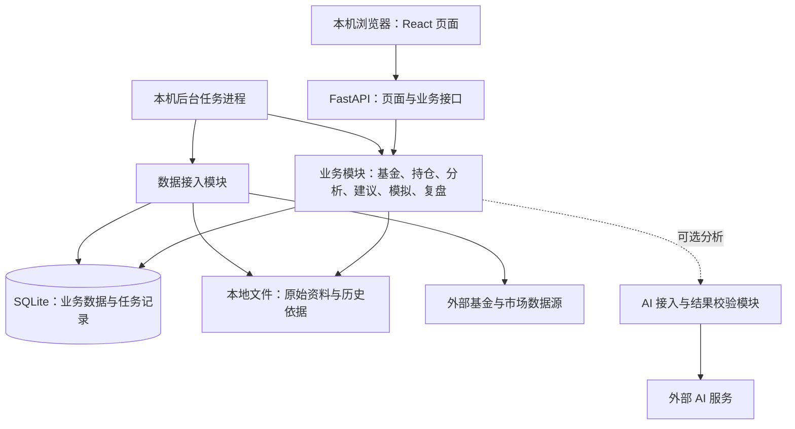

# 基金投资建议工具：整体技术架构

- 更新日期：2026-09-13
- 文档定位：说明整体技术框架与选择原因，列出后续需要细化的大类和注意点，供检查范围是否完整。
- 适用范围：单人开发、个人使用、仅本地部署。
- 需求依据：[产品目标与用户流程](product-goals-and-user-flow.md)。

## 1. 整体技术框架

采用 **React + TypeScript 前端、Python + FastAPI 后端、SQLite 数据库、本地文件存储和一个本机后台任务进程**。

通过本机浏览器使用，前端页面由本地后端提供。后端按业务模块组织，页面请求和后台任务共用分析、交易规则、模拟及复盘逻辑。基金数据更新需要联网，已有数据和个人记录保存在本地。

投资分析采用“本地量化计算 + 可配置的外接 AI 分析”。外接 AI 纳入架构设计，具体服务商与模型后续选择；启用后会将选定的分析资料发送给服务商，本地部署与调用外部服务可以并存。

业务链路为：**基金与市场数据 → 板块分析 → 基金推荐和操作建议 → 用户决定与实际操作 → 模拟及收益对比 → 复盘与策略改良**。

发现机会、辅助决策、复盘与策略改良都属于首版目标。架构围绕这条完整链路建设。

## 2. 技术选择及原因

| 大类 | 当前选择 | 选择原因与主要取舍 |
| --- | --- | --- |
| 应用形态 | 本地 Web 应用，以本机浏览器访问 | 适合一人开发维护，便于制作图表、表单和历史对比；无需分别开发桌面客户端和原生 App。 |
| 前端 | React + TypeScript + Vite；图表使用 ECharts | 组织基金查询、持仓录入和三周期结果等交互；类型约束减少接口误用，现成图表组件减少重复开发。 |
| 后端 | Python + FastAPI，按业务模块组织的单体应用 | 数据接入、分析与模拟统一使用 Python，便于复用计算逻辑；模块化结构足以管理首版复杂度。 |
| 分析与计算 | pandas、NumPy；金额和费用采用 Decimal | 便于处理历史序列与统计分析，同时保证交易记账和费用计算需要的精度。具体算法后续设计。 |
| 数据存储 | SQLite + 本地文件 | 无需维护数据库服务；关系数据便于查询，原始资料便于核对和备份。需关注并发写入、金额精度和历史数据增长。 |
| 后台执行 | 一个本机独立任务进程，任务状态持久化 | 采集和计算不阻塞页面，退出后能够恢复；串行执行减少资源占用及调度复杂度，代价是耗时任务可能排队。 |
| 数据接入 | 独立适配模块；优先验证 AKShare，Tushare 作为备选 | 先验证基金数据覆盖与质量，将来源差异与业务逻辑分开；实际来源、费用和使用条件仍需核实。 |
| 投资分析与 AI | 本地量化计算 + 可配置的外接 AI 分析 | 将量化指标与公告、政策等资料结合，形成综合判断和候选建议；金额计算与约束校验由本地程序负责，AI 的实际增益、调用成本和稳定性需要验证。 |
| 本地运行 | 本地启动器管理后端与任务，后端提供构建后的前端页面 | 日常启动和停止集中管理；首版无需 PostgreSQL、Redis、Celery、Nginx 或 Docker 等独立服务。 |

SQLite 的本地存储定位及写入并发限制是此处选型的重要依据；其余选择结合本项目的交互和分析需求作出。[SQLite 适用场景](https://www.sqlite.org/whentouse.html)、[React 应用构建说明](https://react.dev/learn/build-a-react-app-from-scratch)、[FastAPI 功能说明](https://fastapi.tiangolo.com/features/)。

## 3. 后续详细设计的大类与注意点

按 **界面展示、数据管理、投资分析、记录与对比、策略改良、本地运行** 六类组织。每类列出需要细化的重点；其中界面部分给出初步展示建议，具体页面样式、数据结构和实现方式后续补充。

### 3.1 界面展示与交互

- **页面组织**：建议设置“基金与板块”“我的持仓”“建议与决策”“收益与复盘”四个主要入口，数据更新与备份等放入设置；首次打开即可浏览基金，不要求先录持仓。
- **布局与视觉**：以桌面浏览器为主，采用清晰导航和主内容区；统一字号层级、间距、金额单位与涨跌标识，避免只靠颜色传达含义，窄窗口下仍保持内容可读。
- **信息层级与三周期展示**：先呈现结论、主要风险和数据日期，再展开理由与依据；短、中、长期在同页对照，宽窗口可并列、窄窗口可纵向排列，不要求先选一个周期。
- **基金与持仓展示**：基金详情先明确名称与份额类别，再将走势、披露股票和板块分布分区关联展示；持仓以汇总加逐笔明细呈现，突出仓位、持有时间及相关费用，便于从建议回看对应基金和交易。
- **收益与复盘展示**：建议采用实际/模拟对比曲线、三周期结果表和决策时间线，明确比较期间、投入、收益及差异；新旧策略展示修改点和后续表现，并能查看当时的理由和操作。
- **状态与操作反馈**：统一显示交易 K 线/净值、实际/模拟、估算/确认、来源及更新日期；AI 分析标明依据、生成时间及是否可用。设计空数据、加载、失败、补跑和数据过期状态，以及录入校验、分步补全和保存反馈。“采纳建议”与“记录实际操作”使用独立操作入口。

### 3.2 基金数据与存储

- **基金库与身份**：A 股相关范围、份额类别、历史基金和代码映射；预先收录、名称/代码搜索及少数缺失基金补录，避免重复记录。
- **来源与质量**：目录、行情、净值、持仓、板块和规则的来源、覆盖、费用及使用条件；初始化、增量更新、历史回填、异常与来源切换，区分“可搜索”和“足够分析”。
- **分析资料**：如需 AI 解读公告、政策、新闻或研报，需明确资料来源、发布时间、获取方式与使用范围；不能将模型自身知识当作最新市场事实。
- **投资内容与归属**：真实交易行情与净值的区别、分红和复权口径；披露持仓范围、ETF 联接穿透、直接/间接暴露、未知部分，以及行业与主题重叠。
- **历史时点与版本**：数据反映日期、公开时间、获取时间、分类变化和修订版本；保留当时可用的依据，新数据不覆盖旧记录。
- **存储与一致性**：基金、账本、建议、模拟和策略版本的组织，以及原始资料与计算结果的分工；金额、份额、净值及费用的精度与舍入，重复提交及并发写入处理，以及复算和资料保留范围。

### 3.3 投资分析与建议

- **周期与分析方法**：短、中、长期的边界、观察窗口和更新频率；板块特征、评分、风险指标及参数如何选择和验证。
- **外接 AI 分析**：基于有来源和时间标识的市场数据、量化结果及必要的个人投资条件，分析板块逻辑与事件影响，形成三周期综合判断、风险解释和候选建议；后续明确具体模型及参与环节。
- **本地与 AI 的协作**：本地程序负责精确计算、资金与交易规则约束、模拟及结果校验；区分来源事实、AI 判断和待验证建议，明确结论冲突、依据不足或输出错误时如何处理。通过约束校验不等于投资判断已被证实。
- **板块到基金的匹配**：投资内容、板块暴露、基金特点、费用和可交易条件如何影响筛选。
- **个人投资约束**：现有持仓、现金、可追加资金、风险要求、集中度、持有期限和交易规则如何影响建议。
- **操作与有效条件**：建仓、增仓、减仓、持有、暂不操作，以及金额或仓位目标；区分分析观点与可模拟操作，明确建议更新、过期和失效条件。
- **依据与不确定性**：保存推荐理由、主要风险、输入和策略版本；AI 调用另保留所用资料、模型与提示版本、原始输出及校验结果。处理数据不足、个人信息未确认及三周期意见冲突，历史以当时保存的输出为准。

### 3.4 持仓、决策记录与模拟对比

- **账本与费用**：分批买入、部分卖出、申请确认、到账、分红和份额变化；份额/渠道费率、持有期限、赎回批次与费用边界，区分估算和已确认记录。
- **决定与实际操作**：分别保留全部采纳、部分采纳、未采纳、暂不操作及个人理由，支持尚未操作、延后操作和自主交易。
- **历史关联与更正**：建议、决定、交易及当时依据如何对应；更正保留原记录，避免重复记账、重复扣费或改写历史建议。
- **模拟范围与执行**：三周期分别模拟，区分单次评估和持续比较；明确成交时点、资金、费用、分红、申赎限制及无法成交的处理。
- **资金与收益口径**：统一起点、初始资产、外部入金出金和比较期间，定义收益金额、收益率及风险指标；三个独立模拟账户的资金和收益不能直接相加。
- **结果真实性**：实际结果、当时建议回放、独立策略试验与事后回测分别记录；不使用未来信息或已错过的价格，说明数据滞后、缺失和估算的影响。AI 历史重建需考虑模型事后知识带入未来信息的风险，不能冒充当时的前瞻分析。

### 3.5 复盘与策略改良

- **问题识别**：同时检查系统策略与用户投资方法，结合周期、多次决策和持续表现提出线索；单次亏损不能直接判定失效。
- **候选修订**：AI 可参与提出问题假设和修订方向，但需关联记录并经过验证；说明可能原因、修改点、证据、适用条件和取舍，用户方法尚不明确时不能虚构可回测规则。
- **独立验证**：修订数据与未参与修订的数据分开，在一致的资金、费用和执行条件下比较，控制反复试参及重叠样本带来的偏差；比较启用 AI 与仅用本地规则的效果，不能以文字更流畅判断分析更有效。
- **持续观察**：跟踪收益、风险和费用变化，如实呈现改善、恶化或证据不足；离线补算与当时持续跟踪区分。
- **采用与恢复**：保留原方案、候选版本和生效时间，支持恢复或再次修订；当前按本人显式启用设计，具体条件后续细化。

### 3.6 本地运行与工程保障

- **模块与接口**：模块职责、共享计算逻辑、前后端数据约定和查询范围；环境、依赖版本、开发与日常运行方式，以及启动、停止和升级。
- **后台任务与恢复**：采集、补录、计算、模拟和复盘的触发与依赖；排队、进度、超时、取消、重试和重复启动，处理断网、退出、关机与休眠后的补跑，不能补造未发布的历史建议。
- **本机数据保护**：仅本机访问、无注册登录；必要的请求校验、密钥管理及外部发送数据的边界。
- **AI 接口运行**：服务商与模型选择、接口配置、调用费用、限流与超时；未启用、断网或调用失败时保留本地分析能力，明确哪些 AI 结果缺失，避免无标识地用旧结果替代。
- **备份与运行状态**：数据目录、数据库和原始资料的成套备份、导出与恢复；日志、数据新鲜度、任务错误、磁盘、内存和耗时。
- **测试与验收**：覆盖基金数据、展示标识、交易费用、模拟收益、历史版本和异常恢复；贯穿从搜索基金到策略改良的完整流程，检查本机使用体验。

## 4. 后续补充方式

本轮先审查第 3 节的大类和小点是否有遗漏、重复或范围不合适。确认后，再按对应主题补充数据字段、接口约定、计算公式、策略参数、任务恢复机制和验收用例；本版不展开这些详细设计。
