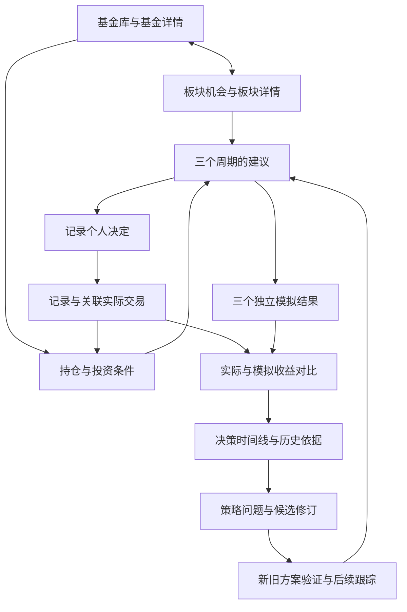

# 3.1 界面展示与交互开发文档

- 更新日期：2026-09-13
- 状态：待审查草案；本文新增的页面组织、布局参数和交互方案均为建议，审查后作为实现依据。
- 对应章节：[整体技术架构 §3.1](technical-architecture.md#31-界面展示与交互)。
- 需求依据：[产品目标与用户流程](product-goals-and-user-flow.md)，以及整体技术架构 §3.2–§3.6。
- 本轮交付：明确完整界面范围、页面内容、交互行为、开发拆分和验收场景，供开始页面实现前审查。

## 1. 设计范围与基本约束

界面围绕“发现机会 → 查看适合自己的建议 → 记录决定与交易 → 比较结果 → 复盘并检验改良”组织。发现机会、辅助决策、复盘与策略改良都是首版能力，需要在本轮设计中形成完整路径。

下列要求沿用已有产品和架构文档：

- 个人使用、仅本机浏览器访问，无注册登录；基金浏览不以录入持仓或启用 AI 为前提。
- 短期（一周以上、一个月以内）、中期（1–3 个月）、长期（3–6 个月）全部展示。具体交界日期归属和日期换算由后续业务设计统一提供。
- 区分交易价格与净值、公开披露与实时信息、已确认与估算、实际结果与模拟结果。
- 系统建议、用户决定、实际操作各自保留历史，通过关联入口共同回看。
- 三个周期的建议与模拟独立呈现；用户只有一份实际账本，三个模拟账户的金额和收益不能直接相加。
- 新数据、新建议或新策略产生后，历史记录仍能展示当时保存的内容与依据。
- AI 可配置；使用情况、所依据资料和缺失状态可见，已有本地资料与可用分析能够继续查看。

本文确定页面需要表达的业务含义。收益公式、评分权重、交易日历、费率边界、数据过期阈值及策略启用条件等，归对应业务章节详细设计；页面展示这些规则的结果和说明，不自行补出业务结论。

## 2. 页面组织与导航

### 2.1 主要入口

建议采用左侧主导航、顶部工具区和右侧主内容区。保留架构中的四个主要入口，“设置”置于导航底部；后台任务通过顶部状态入口随时查看。

| 主入口 | 页面与页内分区 | 用户在这里完成什么 |
| --- | --- | --- |
| 基金与板块 | 基金库、基金详情、板块机会、板块详情 | 找到基金，查看投资内容与三个周期的机会，沿板块找到相关基金。 |
| 我的持仓 | 持仓总览、单基金持仓明细、交易记录、投资条件 | 维护真实持仓、现金、交易规则和个人要求，补全影响建议的信息。 |
| 建议与决策 | 当前建议、建议详情、决策记录与详情 | 查看三个周期的推荐和操作方案，记录自己的选择并关联实际操作。 |
| 收益与复盘 | 收益对比、决策时间线、策略改良与版本详情 | 对比实际与模拟，回看依据，验证和持续跟踪候选修订。 |
| 设置 | 数据与更新、任务记录、AI 分析、本地备份与运行状态 | 管理数据可用性、AI 使用、任务异常与本机资料。 |

首次进入默认打开“基金与板块／基金库”，顶部提供“基金库”“板块机会”切换。无需增加独立首页；用户回访时可恢复上次所在主入口。详情页支持直接打开和浏览器前进、后退，返回列表恢复搜索、筛选、排序和滚动位置。

顶部工具区包含基金名称／代码搜索、数据状态、任务入口。搜索结果明确基金代码和份额类别；未收录时可进入代码补录。主内容区的页标题下放置本页说明、数据日期和主要操作，避免所有页面都重复展示资产卡片。

### 2.2 页面之间的关联

从任意历史记录查看基金时，默认保留原记录的时点上下文，明确提供“查看当前基金资料”入口。跨页链接携带具体建议、决定、交易或策略版本，返回时仍定位原记录。由建议页进入持仓／条件补全，或由缺资料区块进入更新任务后，完成时提供“返回原页面”入口，保留原对象和输入；新数据可用时提示重新获取结果。

## 3. 统一布局与视觉规则

### 3.1 页面骨架

| 区域 | 建议表现 |
| --- | --- |
| 主导航 | 宽窗口固定约 208 px，显示四个主要入口与底部设置；当前入口有形状和文字状态。 |
| 顶部工具区 | 高约 56 px；搜索保持可访问，数据异常和任务进度使用简短文字加状态图标。 |
| 内容标题区 | 页面名称、对象身份、上下文日期、主要操作；一页只突出当前最重要的操作。 |
| 结论与摘要区 | 先展示核心结论、主要风险、数据时间，再展示曲线、明细及解释。 |
| 详情区 | 内容卡片、表格和展开区；来源、公式说明、原始依据按需展开。 |
| 录入与确认 | 简单补充使用侧栏；逐笔交易等多步骤操作使用独立表单页面；确认框只承载简短且明确的确认。 |

建议采用浅色背景、白色内容面板和蓝色主操作，减少装饰。正文 14–16 px，页标题 24 px，区块标题 18 px，辅助说明 12–13 px；间距统一使用 4、8、12、16、24、32 px。重要数字使用等宽数字并右对齐，长名称可换行，代码与份额类别保持可见。

涨幅与盈利使用红色及“+”，跌幅与亏损使用绿色及“−”；操作成功、风险等级使用独立图标和文字，避免与涨跌含义混淆。实际、短期模拟、中期模拟、长期模拟使用固定图例与不同线型，不能仅靠颜色区分。

### 3.2 窗口适配与可操作性

- 内容区宽度不少于 1,080 px 时，三个周期并列等宽；不足时按短、中、长期纵向排列，始终保留三个摘要，详情可以分别展开。
- 浏览器宽度不少于 1,280 px 时显示完整侧栏；960–1,279 px 时使用可展开的紧凑导航；小于 960 px 时导航收进菜单，内容单列。
- 在 768 px 窗口和浏览器放大后，搜索、表单和主要操作仍可用。宽表格可在自身区域横向滚动，页面主体不整体横向溢出；在图表下提供可读数据摘要。
- 筛选项、图例、表格行操作支持键盘使用，焦点可见；表单字段有文字标签，错误信息关联具体字段，不只通过颜色或短暂浮层提示。
- 危险或影响历史的操作显示对象和影响；普通保存用明确反馈，不反复弹出确认。表单存在未保存修改时，离开页面应提醒。

### 3.3 全站数据表达

| 信息 | 统一表达规则 |
| --- | --- |
| 金额与份额 | 人民币金额默认以“元”展示；总览可用“万元”并可查看完整金额。份额、净值按业务精度展示，不能为了表格整齐截断账本含义。 |
| 收益与差异 | 金额、收益率分开列；收益率之差标为“百分点”。负数显示负号，缺失显示“—”并说明原因，明确的零才显示 0。 |
| 时间 | 短日期用 YYYY-MM-DD；事件记录附具体时间并标明北京时间。分别展示数据反映日期、公开时间、获取时间和分析生成时间，不用一个“更新时间”替代全部含义。 |
| 新鲜度与覆盖 | 主区展示最相关的数据日期与状态；混合来源按区块显示日期。详情可查看覆盖范围、缺失部分、来源和原始资料。 |
| 历史与当前 | 历史页显著标注“当时记录”、生成时间、策略版本；查看新版本使用独立入口。当前资料不得静默替换历史依据。 |
| 结论来源 | 分开标识“来源事实”“本地计算”“AI 分析”；候选意见、证据不足、规则校验未通过等状态直接显示在结论旁。 |
| 排序与评分 | 列表说明默认排序依据；没有可用评分的条目显示未评估，不显示为 0 分，也不以空值产生伪排名。 |

## 4. 基金与板块

### 4.1 基金库

页面由搜索与筛选、基金列表、数据覆盖说明组成。搜索支持名称和代码；结果列出基金名称、代码、份额类别、基金类型、最新净值或行情及日期、相关板块、资料可用状态。相近名称或同一基金不同份额分别显示，不自动替用户选择。

历史代码或曾用名称命中时，显示其与当前身份的对应关系并进入同一基金记录；历史基金保留可查询入口，标明当前状态和资料截止日期，不表现为仍可进行新交易。

建议首版提供基金类型、行业／主题、资料可用程度筛选；搜索时优先显示准确代码匹配，其余排序方式明确标注。“仅显示我的持仓”可作为快捷筛选，未录持仓不影响全库浏览。列表分页，搜索和筛选改变后回到第一页，保留条件并显示结果数量。

“可搜索”“基础资料可用”“可进行分析”分别表达，具体分析能力按实际缺失项说明，例如“缺少历史净值，暂不能生成趋势分析”。首次目录正在初始化时显示已可浏览部分、初始化进度和失败重试入口；若尚无目录，说明正在准备基金库。

搜索无结果时，保留输入并提供“按基金代码补充”。流程为输入代码 → 查询身份 → 确认名称和份额类别 → 提交补录 → 查看进度／进入详情。代码格式错误在提交前提示；未找到、已收录、来源不可用分别反馈。重复提交跳转已有基金或已有任务；补录可以后台继续，不能因资料下载未完成而显示“分析已可用”。

### 4.2 基金详情

基金名称、代码、份额类别、基金类型固定出现在页首，操作为“录入持仓”“查看相关建议”；已持有时另提供“查看我的持仓”。主体按以下顺序展示：

| 分区 | 必须展示的内容与交互 |
| --- | --- |
| 概况 | 最新可用净值／交易价格及日期、基金状态、资料覆盖与明显缺口；费用规则提供入口并显示适用份额和来源。 |
| 走势 | 有真实开高低收数据时提供交易 K 线；只有净值时展示净值曲线。两者都可用时明确切换，标题、单位、复权／分红口径随之更新。历史查看范围建议为近 1 月、3 月、6 月、1 年、全部及自定义，范围受实际数据覆盖限制。 |
| 披露股票 | 股票名称与代码、披露权重、所属行业／主题、持仓日期和披露范围；可按权重排序、点击查看关联板块。标明是前十大等部分披露还是较完整披露，不把缺失部分当作未持有。 |
| 板块分布 | 展示主要行业／主题、归属依据、已识别与未知部分；选择板块可联动高亮对应股票，并进入板块详情。 |
| 三周期分析 | 短、中、长期各自的判断、理由、主要风险、依据日期与可用状态；可进入对应推荐或操作建议。 |
| 依据资料 | 来源、数据反映日期、公开与获取时间、分类版本；查看保存的资料或原始来源，来源无法访问时仍说明已保存资料范围。 |

行业分布采用具有明确分母的条形图或表格；主题可能重叠，逐项显示暴露比例并说明不能直接求和，不使用暗示合计为 100% 的主题饼图。无法识别的部分单列，不按已披露持仓强行归一成完整基金配置。

ETF 联接基金展示“本基金 → 目标 ETF → 披露股票／板块”的关系，区分直接持有、通过 ETF 间接暴露和未穿透部分。不同层级的日期分别标明，避免把同一暴露重复汇总。

曲线缺少部分日期时显示缺口或明确断点，悬停展示当天实际可用值；无相应数据时解释原因。历史查看范围与短、中、长期分析周期为两组独立控件，改变图表范围不会隐式改变建议周期。

### 4.3 板块机会与板块详情

“板块机会”在同页展示三个周期，每列包含可关注板块、判断摘要、理由、主要风险及依据日期。行业与主题有清晰分类；有排序或评分时说明依据及适用版本。暂无机会、缺少资料和分析失败是不同状态，不能统称“没有推荐”。

板块详情展示板块定义、趋势与可用指标、支撑资料、三个周期分析、相关基金。相关基金列表解释匹配依据、暴露程度、费用与可交易条件，标明是否持有。缺少投资条件时显示“相关基金”；取得有效个性化分析后才显示“适合我的推荐”。

用户可从板块进入基金详情或对应建议。从基金进入板块后保留来源基金提示，便于在板块中理解该基金的投资关联。

## 5. 我的持仓

### 5.1 持仓总览与明细

顶部展示已记录资产、基金市值、现金、待确认／待到账金额和估值日期；缺少现金或部分持仓时，标注“已记录部分”及覆盖提示，不能暗示这是用户全部资产。仓位显示分母口径，现金未知时不提供貌似完整的总资产仓位。

持仓列表展示基金身份、渠道、确认份额、已记录成本、当前估值／市值、收益及口径、可用仓位、最早持有时间和待处理事项。不同渠道、份额类别的费用不能混用；总览可按基金聚合，展开后仍保留渠道与批次。

单基金持仓详情包含汇总、逐笔买入与剩余份额、持有时间、适用费用、实际交易时间线和关联建议。记录是否完整、数值是估算还是确认，须在相关数值旁标明。批次持有天数和预计赎回费用由业务模块返回，允许查看其起算日期和规则依据。

### 5.2 录入、补全与交易更正

“录入已有持仓”与“记录实际交易”提供明确入口。已有持仓可从基本买入信息开始逐笔补全；如果只能提供某日持仓汇总，应作为初始持仓记录并标明历史不完整，后续补入交易时由业务层识别与初始记录的关系，避免把同一投入重复记账。

建议采用三步表单，并保持已填内容：

1. 选择记录类型，基金交易确认基金、份额类别和渠道，现金入金出金确认资金方向和所属账本。
2. 填写已知日期、买入金额或交易数量，补充确认份额、净值、费用及交易状态；不同操作只展示适用字段。
3. 核对交易规则和记录摘要，明确哪些已确认、哪些待补全，再保存。

支持买入／增仓、卖出／减仓、现金入金出金、分红与份额变化等记录。申请日期、确认日期、到账日期分别填写；缺少渠道确认数据时可保存待补全记录。待确认交易的资金占用应独立显示，持仓与可用现金按业务确认状态更新。实际交易列表区分申请中、待确认、已确认、待到账、已完成、失败／已撤销等适用状态，具体状态转换由账本规则确定。

必要校验包括必填项、合法日期和数值、卖出超出可用份额、费率区间重叠与缺口、疑似重复交易。若账本不完整导致已发生的真实卖出无法核对，允许暂存为待核对记录并引导补入初始持仓或缺失买入，不直接计入已确认账本。缺少影响精确核算的信息时，可保存为待补全；页面列出补全入口，以及因此暂不可用的精确收益或操作建议。提交中防重复点击，保存失败保留输入；提交结果不明时先查询原记录状态。

已保存的交易使用“更正记录”，显示原值、新值、原因及受影响的持仓／收益；保留更正链。撤销误录也保留状态与原因，不能通过无痕删除已关联交易来重写历史。删除尚未保存的草稿可直接处理。

### 5.3 交易规则与投资条件

交易规则归属于具体基金、份额类别和适用渠道，展示来源、确认状态、生效范围及核对日期。赎回费按持有期限逐行展示上下界、是否包含边界和费率，另列可用的其他费用信息。未确认规则明确标注，不将示例费率预填为实际规则。费用试算显示所用批次、预计持有天数、费用、规则与估算标识；实际确认费用单独记录。

投资条件页维护已知现金、可追加资金、风险要求、集中度限制、预期持有期限和其他已支持约束。区分现金余额与未来愿意追加的资金；“尚未录入持仓”和“确认当前没有持仓”是不同情况。风险与资金字段给出通俗说明，不预填用户未表达的偏好。

保存投资条件时显示生效时间；现有建议若因此需要重新评估，提示其使用的是旧条件，并提供生成新建议入口。历史建议保留原投资条件。影响业务决策的字段完整性要求由 §3.3 确定，界面根据缺失清单引导补全。

## 6. 建议与决策

### 6.1 当前建议与详情

顶部显示所用持仓与投资条件、分析生成时间、数据范围、策略版本、本地与 AI 的参与状态。主要操作为“更新分析”；提交后展示排队或执行状态，成功产生新版本，旧版本从历史入口查看。

每个周期同时包含板块方向、候选基金和持仓操作方案；“持有”“暂不操作”也作为有理由的有效结果展示。每项建议至少显示：基金身份、建议操作、金额／仓位目标或待计算状态、主要理由、主要风险、适用条件、有效状态，以及“查看依据”“记录决定”入口。

详情先展示结论和风险，再展开量化结果、来源事实、AI 分析、交易与资金约束校验、所用输入及历史版本。校验通过只说明满足对应规则，不显示为“已证明有效”。证据不足或 AI 输出校验失败时，说明受影响部分及可用的本地结果。

本地分析与 AI 判断冲突时，分别显示结论、依据和时点，以及业务层提供的综合状态与处理理由，不静默合并成一致意见。没有来源支持的 AI 市场陈述标为待核实，不能充当最新事实；只有分析观点、尚未形成可模拟操作时，明确显示“暂不能用于操作模拟”及原因。

同一基金三个周期出现不同方向时，并列解释各周期的理由及条件，不自动合并成一个操作。三个周期是供比较的独立方案，界面不提供跨周期一键全部执行；用户可以记录自己综合判断后的一个实际决定，并关联相关建议。

无持仓时仍可查看板块与相关基金；用户确认没有持仓并提供必要条件后，可生成个性化建仓方案。条件不完整时按缺失项说明个性化能力暂不可用，不能用默认资金推导具体下单金额。

建议的新旧与有效性分开显示：新版本产生不抹去旧版；过期、条件已变、规则未通过或生成失败均说明原因。失效建议仍可回看与记录历史事实；若用户现在参考旧建议做决定，明确记录引用的是旧版本并提示重新评估。

### 6.2 记录个人决定

“记录决定”显示引用的建议版本、周期和操作摘要，提供全部采纳、部分采纳、未采纳、暂不操作四种选择，以及自己的计划和理由。部分采纳支持逐项标记和调整计划金额／数量；未采纳可记录自主计划；暂不操作可记录观察条件。

保存后展示决定时间、关联建议和后续操作状态；只记录决定不会更改实际持仓。决定详情提供独立的“记录实际操作”和“关联已有交易”入口，交易表单可以带入计划作为待核对内容，不能自动成为已确认交易。

允许一个决定对应多次分批操作，也允许一笔真实交易关联多个参考建议。关联只用于回看，真实交易在账本中仍是一笔，不能随关联次数重复计入资金与收益。没有参考建议的自主交易也可记录并进入复盘。

### 6.3 决策记录与时间线

列表可按基金、周期、时间、决定类型和实际操作状态筛选；行内展示系统建议、个人选择、已关联操作和待办差异。决定类型与操作状态为不同字段，例如“全部采纳／尚未操作”“部分采纳／已分两次操作”。

详情时间线串联建议生成 → 个人决定 → 分批申请／确认／到账 → 更正 → 对应收益与复盘。延后操作显示计划与实际时间差；用户改变决定时追加变更记录并保留原决定。更正时区分实际发生时间与记录／修改时间，事后补录必须可辨认。

## 7. 收益对比与持续复盘

### 7.1 建立比较与展示前提

收益对比页顶部展示比较期间、初始资产、外部入金出金、费用／分红口径、数据截止日期及覆盖状态。首次建立比较时核对起点、真实账本范围和可用建议，创建三个独立的周期模拟；所需条件不满足时给出具体补全项。

提供“单次建议评估”和“持续跟踪”两种明确模式，分别说明使用哪次建议或如何持续接入当时的新建议。建议回放、独立策略试验、事后回测在结果标题处区分；事后补算显示运行时间和所依据的历史材料，不能表现为当时已发布的建议。

不同周期的可用起点或数据范围不同时，先说明差异；只有同一比较条件下的结果才显示直接差值。不满足条件的结果仍可查看自身表现，但差值显示“暂不可比”及原因。没有真实记录时，只展示模拟并引导建立实际账本，不把实际收益写成 0。

### 7.2 曲线与三周期结果表

主图包含实际结果及短、中、长期三个模拟结果，图例始终列出四者，并允许临时隐藏线条；曲线不同起点和缺口要可见。图表切换“资产金额”“累计收益金额”“收益率”时，标题、单位和口径说明同步更新；外部入金不能被直接画成投资盈利。

叠加累计收益或收益率曲线时，统一比较起点与计算口径。若三周期无法取得共同可比区间，改为三个小图，每个周期分别配同期间的实际曲线和自己的条件说明；不把不同起点的实际收益率画成一条通用基准线。某一周期完全缺少可比结果时，仍保留该周期位置并说明原因。

下方三个周期结果始终可见，每行显示比较期间、投入及外部资金变化、实际收益、模拟收益、差额、收益率及百分点差、费用和可用风险指标。表头固定说明“差额 = 模拟 − 实际”，实际优于模拟时如实显示负差额；不按结果好坏隐藏周期。若各行比较期间不同，实际结果按各自行内期间展示，不能共用一个实际数值。

风险指标可展示业务层提供的回撤等结果，并提供计算口径；缺少样本或不足以计算时说明原因。三个模拟账户分别显示资金使用情况，页首不显示“模拟总收益”或把三份初始资金合成一个总账户。

点击曲线日期或表格中的差异，联动当时建议、个人决定、真实与模拟操作及费用；无法成交、等待确认、现金不足或数据缺失导致的模拟跳过必须有记录，不能只呈现最终收益数字。

### 7.3 决策复盘

复盘页面同时支持按期间浏览和进入单次决定，展示当时系统判断、个人理由、实际操作、模拟执行及结果。差异按时点、仓位、基金选择、费用等已有分析维度呈现，明确已观测事实与可能原因。

用户可补充复盘笔记并关联证据；系统针对系统策略和用户方法分别提出问题线索，说明相关周期、记录数量、观察期间和证据缺口。一次亏损或一次落后只标为观察线索，不能直接显示为“策略失效”。

### 7.4 策略改良与版本详情

策略改良作为“收益与复盘”的直接可见分区，摘要显示待审视问题、候选修订和后续观察状态；没有候选时说明当前未形成修订方向或证据不足。

| 分区 | 展示与操作 |
| --- | --- |
| 问题与依据 | 受影响对象为系统策略或用户方法、相关周期、可能原因、支持／反对证据、关联决定与收益记录。 |
| 原方案与候选方案 | 逐项比较修改内容、修改理由、适用条件和取舍，显示原版本、候选版本、形成时间及 AI 是否参与。 |
| 验证结果 | 分开显示用于形成修订的资料、未参与修订的验证资料及后续观察；列明时间、样本、资金、费用与执行条件，展示收益、风险和费用的改善、恶化或证据不足。展示业务层提供的验证独立性、样本重叠和反复试参限制，不能仅凭较好结果判定改良有效。 |
| AI 效果对照 | 有相应试验时，对比启用 AI 与仅本地规则的结果，说明条件是否一致；无对照结果时显示未验证，不根据文字质量给出有效结论。 |
| 后续跟踪 | 显示方案开始使用时间、观察区间、后续问题与继续观察理由，区分当时跟踪和离线补算。 |
| 采用与恢复 | 提供查看完整差异、保留当前方案、启用候选、恢复旧方案等适用操作；按钮可用性依据后续业务条件，不能自动采用候选。 |

启用或恢复前展示目标版本、变更摘要、生效时间以及对后续建议和模拟的影响，并由本人确认。成功后保留版本与采用记录；历史建议继续使用其原策略版本。恢复旧方案应产生新的采用记录，不回写过去的生效历史。

用户自己的方法尚不能表达为可验证规则时，展示问题假设和观察建议，标明尚无法进行规则对照。策略研究中的 AI 历史重建需标注可能带入事后知识的限制，与当时真实保存的 AI 输出分开。

## 8. 设置、任务与本地使用

### 8.1 数据更新与任务

数据页按基金目录、行情／净值、披露持仓、板块分类、交易规则和分析资料展示来源、覆盖、最新可用日期与最近更新结果。支持按对象更新、缺口补录、历史回填及查看失败原因；来源和更新方式以实际已支持能力为准。

顶部任务入口显示排队、执行、失败数量，展开显示任务对象、当前阶段、进度或已处理数量、开始时间及可用操作。没有可靠总量时展示阶段与数量，不伪造百分比或剩余时间。单任务进程排队时解释等待原因，离开页面后可从任务记录继续查看。

任务列表区分排队、执行中、等待恢复、已完成、部分完成、失败、取消中及已取消。只对支持取消的任务显示取消入口；取消请求发出后等待确认，已保存的部分结果按实际情况说明。重复发起相同任务定位已有任务；重试只在结果明确可重试时提供。

断网、后台进程停止、休眠或关机恢复后，显示最近成功时间和待补跑内容，允许查看已有资料。恢复状态以重新查询的结果为准；补跑只能补实际数据或明确标识的回算结果，不能显示成错过期间已产生过的历史建议。

### 8.2 AI 分析设置

设置包含启用状态、已支持服务商／模型、必要接口配置、连接检查、调用记录与费用／用量信息。服务商未提供准确费用时显示估算或不可用。密钥输入默认遮蔽，保存后只显示已配置及替换／清除入口，日志和历史详情不回显密钥。

首次启用和资料发送范围变化时，展示将发送的数据类别、接收服务商、是否包含个人持仓／投资条件及用途，由用户确认；后续调用可查看本次范围和所用配置。分析详情可查看资料来源、生成时间、模型和提示版本、原始输出及校验说明。

未启用、配置缺失、连接失败、限流、超时、输出校验失败、资料不足分别说明。旧 AI 结果若仍可查看，显示原生成时间和旧结果标识；更新失败提示本次结果缺失，本地可用分析独立展示。

### 8.3 备份、导出与运行状态

展示本机资料位置、最近完整备份时间、备份范围与执行结果。支持将数据库与原始资料成套备份、导出支持的个人记录、选择备份查看内容摘要并恢复。恢复确认页说明备份时间、包含内容和将替换的本地资料，提示先备份当前资料；恢复结果和失败原因可查询。

运行状态显示后端和任务是否可用、最近错误、资料占用及已支持的资源信息，提供可读问题说明和诊断详情。界面用“数据更新”“后台分析”等用户可理解的名称；具体实现信息放到详情。

## 9. 通用状态与反馈

| 状态 | 用户看到什么 | 下一步 |
| --- | --- | --- |
| 首次使用／空记录 | 明确说明尚无哪类资料，已有基金浏览能力仍可进入。 | 初始化基金库、录入持仓、生成分析或建立比较。 |
| 加载中 | 稳定的页面结构与局部加载状态，已有筛选和已加载信息保留。 | 等待；长任务可离开并查看任务记录。 |
| 部分资料可用 | 可用结果正常展示，缺失区块解释缺口及影响。 | 补全资料或重试相关部分。 |
| 已分析但证据不足／暂不操作 | 分别说明尚不足以形成结论，或已明确建议暂不操作；与尚未分析、分析失败区分。 | 查看依据、补充资料或继续观察。 |
| 数据过期／条件变化 | 原日期和具体影响明显可见；是否还能用于某项操作由业务结果决定。 | 更新资料或重新评估。 |
| 联网失败 | 显示失败对象、最近成功时间与已有本地数据。 | 重试联网任务，继续查看本地资料。 |
| 本地服务不可用 | 显示连接状态，停止新的提交；已加载页面标明可能已过时。 | 通过本地启动器恢复服务，再重新获取状态。 |
| 保存中／结果不明 | 防重复提交，保留输入，不提前显示成功。 | 查询原提交结果，必要时恢复提交。 |
| 保存失败／校验失败 | 字段错误原位显示，页面级错误说明影响；长错误可展开。 | 修正后重试，已有输入保留。 |
| 历史对象缺失或不再可用 | 仍展示已保存的身份与引用信息，说明当前链接目标不可用。 | 返回原记录或查看保存的依据。 |

成功提示应说明保存了什么并提供查看入口；长期待办留在对应页面和任务入口，不能只依赖一闪而过的提示。重新加载页面后恢复可从已保存数据取得的状态，浏览器缓存不作为真实账本或任务成功的依据。

## 10. 前端开发组织与数据配合

### 10.1 页面与公共组件

沿用 React + TypeScript + Vite，图表沿用 ECharts。组件和数据访问按四个业务入口及设置组织；跨页复用基金身份、时间与来源标识、三周期面板、金额与状态展示、趋势图、交易表单、证据展开区、决策时间线、任务进度和版本差异展示。

将页面展示数据与来源响应转换分开，页面只依赖已约定的业务含义。金额、份额和费用的精确计算由业务模块完成，前端不以二进制浮点数自行复算账本。展示格式、筛选和图表交互在前端处理。

### 10.2 后续章节需提供的界面数据

下表约定界面需要的内容，不预先锁定接口地址或数据库字段。

| 负责章节 | 必需的数据与行为 |
| --- | --- |
| §3.2 数据与存储 | 稳定的基金／份额／板块身份、行情类型与精度、披露范围、直接／间接暴露、未知部分、来源与多种日期、版本、缺失项与能力状态。 |
| §3.3 分析与建议 | 三周期名称和范围、结论与风险、依据引用、使用的个人条件、操作及约束校验、有效状态、版本、AI 参与和输出可用情况。 |
| §3.4 账本与模拟 | 精确金额及单位、确认与估算状态、批次和费用规则、资金占用、建议／决定／交易关联、历史更正、比较条件与可比性、收益和风险口径、模拟执行记录。 |
| §3.5 复盘改良 | 问题与证据、原／候选版本差异、修订和验证资料范围、样本与观察时间、验证结果、采用条件与记录、后续跟踪和恢复状态。 |
| §3.6 本地运行 | 持久化任务状态与可用操作、数据更新及恢复状态、AI 配置与发送范围、备份摘要及结果、可供用户理解的错误和重试方式。 |

每个可追溯结果需要稳定标识、相关对象引用、时点与状态。列表查询需要筛选、排序和分页语义；详情要能按具体历史版本读取。页面校验可提前提示格式问题，涉及现金、份额、费用、可比性和策略采用的最终判断以业务层为准。

## 11. 开发顺序与验收场景

### 11.1 建议实施顺序

1. 搭建统一导航、页面骨架、展示规则和公共状态，用明确标识的演示资料检查布局与三周期展示。
2. 实现基金库、基金详情、板块机会及关联导航，覆盖缺失基金、净值／行情差异和披露不完整场景。
3. 实现持仓、逐笔交易、费用与投资条件，再接入三个周期的建议、决定记录和交易关联。
4. 实现实际／模拟比较、决策复盘、候选修订和版本跟踪，完成从基金搜索到策略改良的页面闭环。
5. 完成数据与任务、AI 设置、备份及异常恢复的联动，并用真实接口验证全流程。

这些步骤是实现顺序，均属于首版范围。页面开发早期可使用演示数据；演示环境需持续标注，不能把演示收益、虚构任务成功或占位分析作为真实结果。每组页面同时完成正常、空白、加载、缺失和失败状态，再进行跨页面联调。

### 11.2 可审查、可验收的场景

| 编号 | 场景 | 通过条件 |
| --- | --- | --- |
| UI-01 | 新用户尚无持仓且未配置 AI | 能进入基金库搜索；个性化能力说明缺失条件；首次准备数据有明确状态。 |
| UI-02 | 同名基金有不同份额，另有少数未收录基金 | 代码与份额清晰；补录先确认身份；重复操作不产生重复基金或任务。 |
| UI-03 | 分别查看有交易行情、只有净值及历史数据有缺口的基金 | 图表类型、单位、日期与可用数据一致，无伪 K 线、伪补点或静默替换。 |
| UI-04 | 查看披露不完整、主题重叠和 ETF 联接基金 | 可见披露范围、多层日期、间接暴露及未知部分，不重复计数或伪装完整分布。 |
| UI-05 | 宽窗口、768 px 窗口、放大页面及键盘操作 | 三周期摘要均可见，关键操作和表单可达，页面无整体横向溢出，表格和图例可理解。 |
| UI-06 | 多次买入、部分卖出、待确认交易和缺失费率 | 批次与渠道保留，待确认金额独立，费用标识明确；不足信息可补全，无法核对的卖出暂存待核对且不直接改变确认账本。 |
| UI-07 | 初始持仓后补历史交易，并更正已保存记录 | 不重复记账；原记录、变更原因和影响可查；收益完整性状态随实际情况更新。 |
| UI-08 | 同一基金三个周期出现不同方向，投资条件随后改变 | 三套理由可对照；条件变化可识别；历史建议保存原输入，不自动叠加操作金额。 |
| UI-09 | 全部采纳但未操作、部分采纳后分批操作、自主交易 | 决定与操作状态独立；保存决定不改账，关联真实交易后按其确认状态核算；同一交易多处关联仍只计一次。 |
| UI-10 | 连续点击保存、保存超时、刷新或返回列表 | 能确认原提交状态并保留输入；不重复记账；列表上下文与已保存状态可恢复。 |
| UI-11 | 比较期间不同、有外部入金、实际记录缺失 | 可比条件清晰；曲线起点与口径一致或分图展示，不可比时无直接差值；入金不当作收益，三个模拟不汇总为一个账户。 |
| UI-12 | 实际结果优于某周期模拟，模拟有无法成交记录 | 差额符号与口径正确；实际较好如实呈现；可从差异追溯具体执行与费用。 |
| UI-13 | 事后回测、补跑分析与真实历史建议同时存在 | 类型、生成时间和资料时点清楚；补算结果不伪装当时已发布建议。 |
| UI-14 | 查看候选策略改善、恶化、验证有偏差和证据不足，再启用与恢复 | 修改、验证独立性和试参限制及后续表现可查；本人显式确认；历史建议和采用记录不被覆盖。 |
| UI-15 | AI 未启用、超时、校验失败或与本地判断冲突 | 本地可用结果仍可看；缺失与冲突说明准确；旧输出有时间标识；发送范围和密钥表现符合设计。 |
| UI-16 | 任务排队、部分失败、取消、断网及本地服务恢复 | 进度真实，可查部分结果与重试状态；恢复后查询持久状态，不虚报成功或遗失已保存资料。 |
| UI-17 | 成套备份、恢复预览及恢复失败 | 范围和替换影响清晰，确认后执行；结果可查，失败不提示成功。 |

文档审查检查页面覆盖和交互含义；实现验收再检查实际页面、交互、数据标识及上述场景。业务公式正确性由相应业务测试验证，界面验收还需确认页面使用了正确的结果、单位和状态。

## 12. 本轮建议审查的决定

| 审查项 | 本稿建议 | 审查影响 |
| --- | --- | --- |
| 主导航与默认入口 | 四个业务入口加设置；默认基金库，板块机会同入口切换。 | 决定全站结构及首次使用体验。 |
| 信息密度与视觉 | 桌面浅色界面、摘要在前、依据可展开；三周期宽屏并列、窄屏纵排。 | 决定页面布局与阅读负担。 |
| 持仓与决定录入 | 支持分步补全；决定、交易两个独立入口，允许关联已有真实交易。 | 决定日常录入成本及历史关联体验。 |
| 收益与复盘组织 | 收益对比、决策时间线、策略改良作为直接可见分区。 | 确保三个产品目标都有清楚入口。 |
| 策略采用方式 | 由本人查看差异后显式启用或恢复，保留采用记录。 | 决定候选方案如何影响后续建议。 |

仍需对应业务章节确定的内容包括：周期边界、数据过期与分析门槛、评分和风险指标、费率与日期规则、收益及模拟口径、策略验证和采用条件。当前界面方案已为结果、解释、缺失与不可用状态安排位置；这些业务规则确认后应同步校对受影响页面和验收场景。
